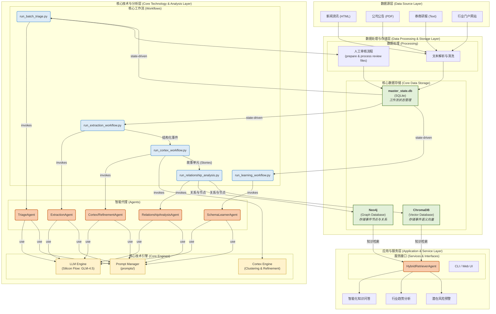
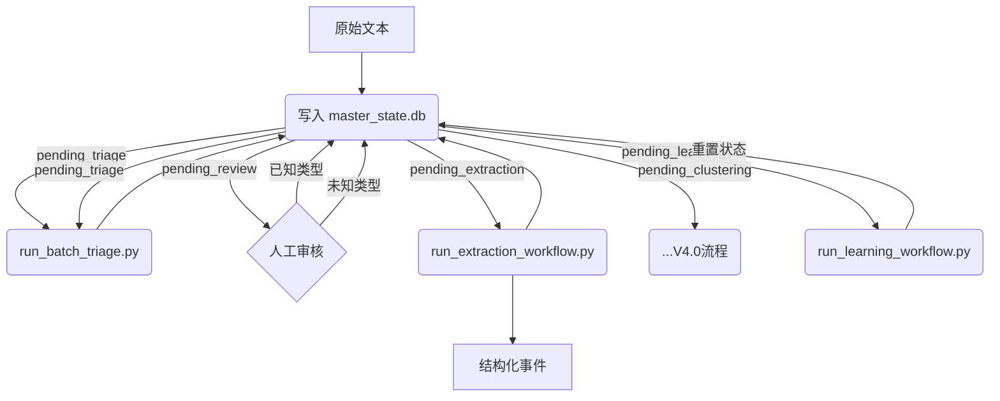
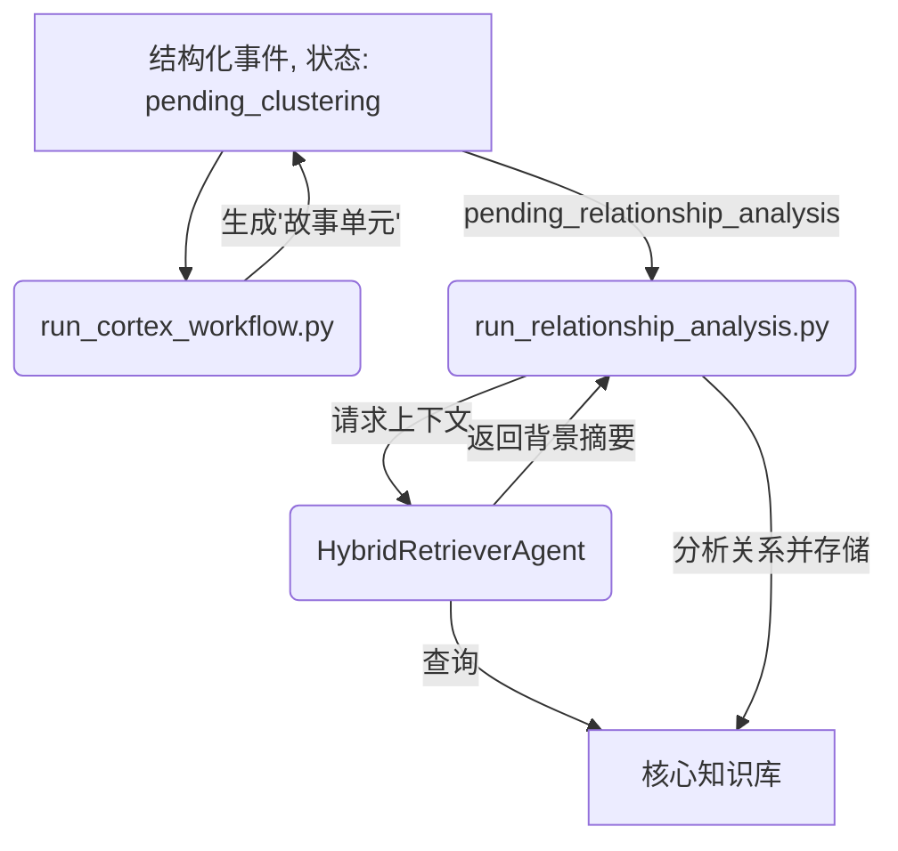

# HyperEventGraph 系统架构文档

**版本**: 4.1.0 (Consolidated)
**状态**: 已定稿
**负责人**: Gemini Architect

---

## 版本历史

| 版本 | 日期       | 作者             | 主要变更                               |
| :--- | :--------- | :--------------- | :------------------------------------- |
| 4.0  | 2025-08-01 | Gemini Architect | 初始草案，定义系统愿景、总体架构。 |
| ...  | ...        | ...              | ... (中间版本省略) ...                 |
| 4.1.0| 2025-08-02 | Gemini Architect | **整合所有详细技术文档，并补充知识迭代闭环策略，形成最终单一文档。** |

---

## 目录

1.  [系统愿景与核心原则](#1-系统愿景与核心原则)
2.  [系统总体架构](#2-系统总体架构)
3.  [数据处理与存储层](#3-数据处理与存储层)
4.  [核心技术与分析层](#4-核心技术与分析层)
5.  [应用与服务层](#5-应用与服务层)
6.  [核心端到端工作流](#6-核心端到端工作流)
7.  [附录](#7-附录)

---

# Chapter 1: 系统愿景与核心原则

### 1.1. 核心愿景：构建“活”的知识系统

HyperEventGraph 的核心目标是构建一个能够**自我完善、持续迭代**的领域事件知识图谱系统。它不仅旨在处理一次性的、静态的数据输入，更致力于在一个**闭环的知识循环 (Knowledge Loop)** 中不断学习、推理和进化。

系统的最终形态是一个智能的决策支持引擎，它能够：
- **自动化知识构建**: 将海量的、非结构化的行业资讯（新闻、公告、研报）自动转化为结构化的、可分析的知识图谱。
- **深度关联分析**: 超越关键词搜索，揭示事件之间深层的、隐藏的逻辑关系（如因果、影响、时序等）。
- **持续学习与进化**: 通过内置的学习工作流和知识反馈闭环，不断适应新的领域知识和事件模式，实现知识边界的自适应扩张。

### 1.2. 设计哲学

为实现上述愿景，系统构建遵循以下核心设计哲学：

- **状态驱动 (State-Driven)**: 系统的所有核心工作流均由一个中央状态数据库驱动。这使得各个模块高度解耦、无状态化，从而保证了系统的健壮性、可扩展性和任务的断点续传能力。
- **人机协同 (Human-in-the-Loop)**: 承认当前AI技术的局限性，将人类专家的智慧无缝集成到工作流中。通过高效的审核与交互式学习界面，确保关键知识的准确性，并由��家引导系统的学习方向。
- **分层存储 (Layered Storage)**: 针对不同知识检索需求，采用混合存储策略。利用图数据库进行精确的结构化查询，利用向量数据库进行模糊的语义化查询，取长补短，实现更强大的知识服务能力。
- **模块化与可配置 (Modular & Configurable)**: 所有核心功能被封装为独立的智能代理（Agents）和工作流（Workflows），所有关键参数由全局配置文件统一管理。这极大地提升了系统的可维护性和部署灵活性。

# Chapter 2: 系统总体架构

### 2.1. 架构分层视图

本系统采用分层架构设计，自下而上分别为：数据源层、数据处理与存储层、核心技术与分析层、应用与服务层。该架构确保了系统各模块的低耦合与高内聚，实现了从原始数据到最终知识服务的清晰流程。



### 2.2. 核心分层职责说明

- **数据源层**: 系统的输入端，负责获取原始、非结构化的文本数据。
- **数据处理与存储层**: 数据的“枢纽站”，负责加工、管理和存储数据，核心是“一个中央状态库，两个核心知识库”。
- **核心技术与分析层**: 系统的“智能核心”，负责所有复杂的分析、抽取、学习和推理任务。
- **应用与服务层**: 系统的价值出口，直接面向最终用户提供服务。

# Chapter 3: 数据处理与存储层

### 3.1. 核心数据存储

#### 3.1.1. 中央状态数据库 (SQLite)

`master_state.db` 是整个系统的“中央神经系统”，精准地记录**每一条数据在知识流水线中的生命周期状态**。

-   **技术选型**: SQLite。轻量、无需独立服务、易于备份和管理。
-   **技术实现**: `DatabaseManager` 类 (`src/core/database_manager.py`) 作为统一访问接口，其关键实现包括：初始化时动态检查并添加新列，确保向后兼容性；提供 `get_records_by_status_as_df` 方法供工作流高效认领任务；并实现了如 `update_story_info` 等批量更新方法以提升性能。
-   **核心表结构 (`MasterState`)**:

| 字段名                | 类型        | 描述                                                     |
| :-------------------- | :---------- | :------------------------------------------------------- |
| `id`                  | `TEXT`      | **主键**。通常是原始文本内容的哈希值。                   |
| `source_text`         | `TEXT`      | 原始文本内容。                                           |
| `current_status`      | `TEXT`      | **核心字段**。标记当前文本所处的处理阶段。               |
| `triage_confidence`   | `REAL`      | 初筛分类的置信度得分（0.0-1.0）。                        |
| `assigned_event_type` | `TEXT`      | 由 TriageAgent 或人工审核指定的事件类型。                |
| `story_id`            | `TEXT`      | 由 Cortex 引擎分配的故事单元ID。                         |
| `notes`               | `TEXT`      | 用于记录处理过程中的备注信息。                           |
| `last_updated`        | `TIMESTAMP` | 记录该条目最后一次更新的时间戳。                         |

-   **状态生命周期**: `pending_triage` -> `pending_review` -> (`pending_extraction` | `pending_learning`) -> `pending_clustering` -> `pending_relationship_analysis` -> `completed`。

#### 3.1.2. 图知识库 (Neo4j)

存储**精确、结构化、高关联度知识**的核心。

-   **核心数据模型**:
    -   **节点**: `Event` (事件), `Entity` (实体)。
    -   **边**: `:INVOLVES` (实体参与事件), `:CAUSAL`, `:TEMPORAL` 等 (事件间逻辑关系)。

#### 3.1.3. 向量知识库 (ChromaDB)

实现**模糊语义检索和相似度计算**的记忆核心。

-   **核心数据模型 (分层向量化策略)**:
    -   **`source_texts`**: 存储原始文本的向量，用于宏观主题搜索。
    -   **`events`**: 存储单个事件描述的向量，用于精确事件搜索。
    -   **`entity_centric_contexts`**: 存储“实体+事件类型+描述”的向量，用于回答“某实体干了什么”的查询。

### 3.2. 数据处理流程

-   **文本解析与清洗**: 将多源异构的原始输入标准化，提取纯文本，计算哈希ID，存入状态库。
-   **人工审核流程**:
    -   `prepare_review_file.py`: 按置信度**升序**生成审核CSV，确保专家优先处理AI最不确定的案例。
    -   `process_review_results.py`: 读取审核结果，将校准后的状态更新回数据库。

# Chapter 4: 核心技术与分析层

### 4.1. 核心技术引擎

-   **LLM Engine (`src/llm/llm_client.py`)**:
    -   **职责**: 封装与大语言模型（Silicon Flow GLM-4.5 系列）的所有交互。
    -   **实现**: 通过读取 `config.yaml` 实现**任务路由**，能根据 `task_type` 自动选择合适的模型和参数。内置安全的JSON解析和异步高并发支持。

-   **Prompt Manager (`src/core/prompt_manager.py`)**:
    -   **职责**: 实现业务逻辑与提示词（`prompts/*.md`）的完全分离。
    -   **实现**: 采用**单例模式**和**内置缓存**，确保提示词模板只从磁盘加载一次，高效地生成最终提示词。

-   **Cortex Engine (`src/cortex/`)**:
    -   **职责**: V4.0架构的核心创新，在关系分析前**重建上下文**。
    -   **实现**: 通过“算法粗聚类 + LLM精炼”两阶段流程工作。`ClusteringOrchestrator` 使用**混合距离DBSCAN算法**（融合向量语义和实体共现）形成粗簇。`RefinementAgent` 通过LLM将粗簇提炼为“故事单元”，并对超大簇采用“分块-摘要-合并”策略。

### 4.2. 智能代理 (Agents)

-   **TriageAgent**: 负责快速初筛。其系统提示**动态构建**，能自动加载所有已知的事件类型，实现认知范围的自适应扩展。
-   **ExtractionAgent**: **Schema驱动**的抽取器。其行为��全由运行时传入的JSON Schema定义，无需修改代码即可适应新事件类型。
-   **RelationshipAnalysisAgent**: 负责深层关系分析。其Prompt整合了**三个层次的上下文**（事件、文档、知识库），并要求LLM提供`reason`字段以增强结果的**可解释性**。
-   **SchemaLearnerAgent**: **工具驱动**并围绕**人机协同**设计，在专家引导下从未知事件中归纳出新的Schema。

### 4.3. 核心模块辨析：模式学习 (Schema Learning) vs. Cortex

| 特性 | **模式学习 (Schema Learning)** | **Cortex (故事发现)** |
| :--- | :--- | :--- |
| **核心目标** | **定义概念 (Concept Definition)** | **重建上下文 (Context Reconstruction)** |
| **解决的问题** | “我们遇到了很多‘高管变动’事件，但还没有模板。**我们来定义一个吧！**” | “这里有50个事件都和A公司有关。**它们是不是在讲同一个故事？**” |
| **输入数据** | `pending_learning` 状态的**未知事件**。 | `pending_clustering` 状态的**已知原子事件**。 |
| **核心方法** | **交互式聚类** + **人机协同**。 | **全自动聚类** + **LLM精炼**。 |
| **输出结果** | 一个新的**事件Schema**，写入 `event_schemas.json`。 | 一个 **`story_id`**，关联一组事件并生成摘要。 |
| **工作流位置** | **���识获取阶段**（为系统“备课”）。 | **数据处理阶段**（在抽取之后，分析之前）。 |

**总结：** 模式学习是“从未知到已知”，负责扩大认知边界。Cortex是“将已知组织化”，负责在已知知识点中发现叙事结构。

# Chapter 5: 应用与服务层

### 5.1. 服务接口: HybridRetrieverAgent

`HybridRetrieverAgent` 是连接知识库与上层应用的关键桥梁，为查询提供丰富、精准、立体的上下文。

-   **工作机制**:
    1.  **接收查询**。
    2.  **并行检索**:
        -   **图数据库查询 (Neo4j)**: 精确的、基于路径的查询，保证结果的**准确性**和**逻辑性**。
        -   **向量数据库查询 (ChromaDB)**: 语义相似度搜索，保证结果的**广度**和**相关性**。
    3.  **结果融合与重排**: 基于加权分数对两路结果进行智能融合。
    4.  **摘要生成**: 将Top-K结果格式化为可直接注入下游LLM Prompt的“背景摘要”。

### 5.2. 核心应用场景

-   **智能化知识问答 (RAG-based Q&A)**: 通过混合检索提供高质量的上下文，使LLM能够生成逻辑清晰、有理有据的回答。
-   **行业趋势分析与风险预警**: 通过分析图谱中的事件模式和关联，提供更高维度的决策支持。

# Chapter 6: 核心端到端工作流

### 6.1. V3.1 核心数据处理流水线

此流程描述了文本从被采集到完成初步事件抽取的路径，由`master_state.db`驱动，并包含一个关键的人机协同环节。



### 6.2. V4.0 知识增强与闭环流程

此流程的核心是引入 **Cortex引擎** 和 **HybridRetrieverAgent**，将单向流水线升级为智能闭环系统。



**流程详解**:
1.  **Cortex上下文重建**: `run_cortex_workflow.py` 将离散事件聚合成“故事单元”，并更新状态为 `pending_relationship_analysis`。
2.  **知识增强的关系分析**: `run_relationship_analysis.py` 启动。在分析前，它首先调用 `HybridRetrieverAgent` 从知识库检索历史背景。
3.  **知识存储**: `RelationshipAnalysisAgent` 在增强的上下文中完成分析，`StorageAgent` 将新知识存入双数据库，完成**最核心的知识闭环**。

### 6.3. 知识迭代闭环策略：系统如何“成长”

1.  **积累阶段 (常规运行)**: 系统在日常处理中，通过人工审核不断积累`pending_learning`状态的“未知事件”。
2.  **触发阶段 (批量学习)**: 当`pending_learning`的事件达到**学习阈值**或由项目经理**手动决定**时，触发学习工作流。
3.  **学习阶段 (交互式定义)**: 专家运行`run_learning_workflow.py`，与`SchemaLearnerAgent`协同，为新的事件簇定义Schema。
4.  **闭环阶段 (学习、抽取与应用)**: 这是知识增长的核心。新Schema保存后，`run_learning_workflow.py`脚本会**立即、自动地**将新学习到的Schema应用于该聚类的所有事件上，进行一次目标明确的事件抽取。
    - **成功**: 抽取出的结构化数据被直接存入数据库，状态变为`processed`，新知识被立刻吸收和应用。
    - **失败**: 状态变为`pending_review`，确保无信息丢失。
    这一“学习-应用”的无缝衔接，取代了过去简单的状态重置，实现了更高效、更智能的知识螺旋式上升。

# Chapter 7: 附录

### 7.1. 术语表 (Glossary)

| 术语 | 英文/组件名 | 解释 |
| :--- | :--- | :--- |
| **状态驱动** | State-Driven | 一种架构模式，系统的行为和流程由中央数据库中记录的状态来决定。 |
| **知识闭环** | Knowledge Loop | 系统利用已存储的知识来增强对新信息的处理和理解能力，形成一个自我完善的循环。 |
| **Cortex引擎** | Cortex Engine | V4.0的核心创新，负责在关系分析前，通过聚类和精炼，对离散事件进行上下文重建。 |
| **故事单元** | Story | 由Cortex引擎生成，是一个逻辑内聚、描述同一个宏观事件的事件集合。 |
| **混合检索** | Hybrid Retrieval | 同时利用图数据库（精确查找）和向量数据库（模糊查找）进行信息检索的策略。 |

### 7.2. 核心配置文件 (`config.yaml`) 解析

`config.yaml` 是系统的中央配置文件，统一管理所有可配置的参数。

```yaml
# config.yaml

# --- 全局模型设置 ---
model_settings:
  cache_dir: "/home/kai/models"

# --- 数据库配置 ---
database:
  path: "master_state.db"

# --- LLM供应商和模型路由配置 ---
llm:
  # ... (providers, models for triage, extraction, etc.)

# --- 工作流特定配置 ---
extraction_workflow:
  output_file: "output/extraction/structured_events.jsonl"

cortex:
  trigger_threshold: 100
  large_cluster_threshold: 20
  # ... (other parameters)

relationship_analysis:
  log_file: "output/logs/relationship_analysis.log"
  raw_output_file: "output/extraction/relationships_raw.jsonl"
  chunk_size: 100

storage:
  neo4j:
    uri: "bolt://localhost:7687"
    user: "neo4j"
    password: "password"
  chroma:
    path: "./chroma_db"
```
