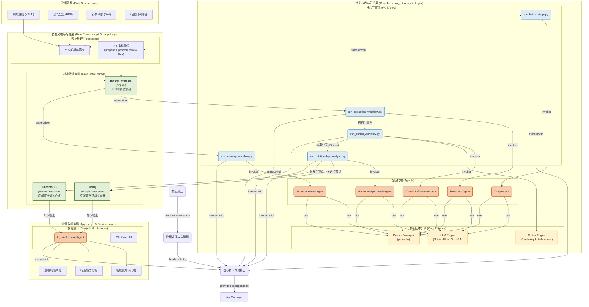
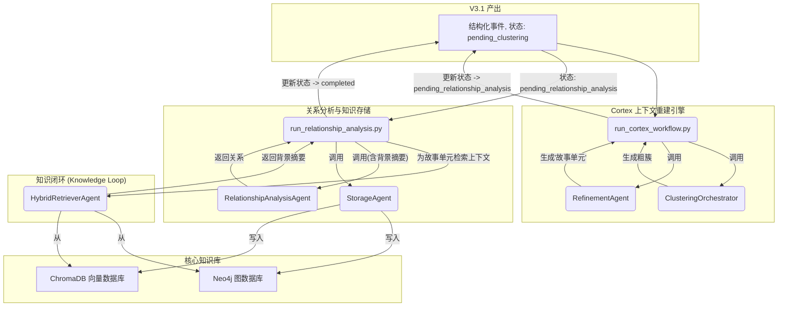

# HyperEventGraph 系统架构文档

**版本**: 4.0.5 (Final)
**状态**: 已定稿
**负责人**: Gemini Architect

---

## 版本历史

| 版本 | 日期       | 作者             | 主要变更                               |
| :--- | :--------- | :--------------- | :------------------------------------- |
| 4.0  | 2025-08-01 | Gemini Architect | 初始草案，定义系统愿景、总体架构。 |
| 4.0.1| 2025-08-01 | Gemini Architect | 完成第三章：数据处理与存储层。         |
| 4.0.2| 2025-08-01 | Gemini Architect | 完成第四章：核心技术与分析层。         |
| 4.0.3| 2025-08-01 | Gemini Architect | 完成第五章：应用与服务层。             |
| 4.0.4| 2025-08-01 | Gemini Architect | 完成第六章：核心端到端工作流。         |
| 4.0.5| 2025-08-01 | Gemini Architect | 完成附录，全文审查并最终定稿。         |

---

## 目录

1.  [系统愿景与核心原则](#1-系统愿景与核心原则)
2.  [系统总体架构](#2-系统总体架构)
3.  [数据处理与存储层](#3-数据处理与存储层)
4.  [核心技术与分析层](#4-核心技术与分析层)
5.  [应用与服务层](#5-应用与服务层)
6.  [核心端到端工作流](#6-核心端到端工作流)
    6.1. [V3.1 核心数据处理流水线](#61-v31-核心数据处理流水线)
    6.2. [V4.0 知识增强与闭环流程](#62-v40-知识增强与闭环流程)
7.  [附录](#7-附录)
    7.1. [术语表 (Glossary)](#71-术语表-glossary)
    7.2. [核心配置文件 (`config.yaml`) 解析](#72-核心配置文件-configyaml-解析)

---

# Chapter 1: 系统愿景与核心原则

### 1.1. 核心愿景：构建“活”的知识系统

HyperEventGraph 的核心目标是构建一个能够**自我完善、持续迭代**的领域事件知识图谱系统。它不仅旨在处理一次性的、静态的数据输入，更致力于在一个**闭环的知识循环 (Knowledge Loop)** 中不断学习、推理和进化。

系统的最终形态是一个智能的决策支持引擎，它能够：
- **自动化知识构建**: 将海量的、非结构化的行业资讯（新闻、公告、研报）自动转化为结构化的、可分析的知识图谱。
- **深度关联分析**: 超越关键词搜索，揭示事件之间深层的、隐藏的逻辑关系（如因果、影响、时序等）。
- **持续学习与进化**: 通过内置的学习工作流和知识反馈闭环，不断适应新的领域知识和事件模式，实现知识边界的自适应扩张。

### 1.2. 设计哲学

为实现上述愿景，系统构建遵循以下核心设计哲学：

- **状态驱动 (State-Driven)**: 系统的所有核心工作流均由一个中央状态数据库驱动。这使得各个模块高度解耦、无状态化，从而保证了系统的健壮性、可扩展性和任务的断点续传能力。
- **人机协同 (Human-in-the-Loop)**: 承认当前AI技术的局限性，将人类专家的智慧无缝集成到工作流中。通过高效的审核与交互式学习界面，确保关键知识的准确性，并由专家引导系统的学习方向。
- **分层存储 (Layered Storage)**: 针对不同知识检索需求，采用混合存储策略。利用图数据库进行精确的结构化查询，利用向量数据库进行模糊的语义化查询，取长补短，实现更强大的知识服务能力。
- **模块化与可配置 (Modular & Configurable)**: 所有核心功能被封装为独立的智能代理（Agents）和工作流（Workflows），所有关键参数由全局配置文件统一管理。这极大地提升了系统的可维护性和部署灵活性。

# Chapter 2: 系统总体架构

### 2.1. 架构分层视图

本系统采用分层架构设计，自下而上分别为：数据源层、数据处理与存储层、核心技术与分析层、应用与服务层。该架构确保了系统各模块的低耦合与高内聚，实现了从原始数据到最终知识服务的清晰流程。



### 2.2. 核心分层职责说明

#### 2.2.1. 数据源层 (Data Source Layer)
- **职责**: 系统的数据输入端，负责从多样化的信息渠道获取原始、非结构化的文本数据。
- **主要构成**: 新闻网站 (HTML)、公司公告 (PDF)、券商研究报告 (Text)、行业门户等。

#### 2.2.2. 数据处理与存储层 (Data Processing & Storage Layer)
- **职责**: 数据的“枢纽站”，负责对原始数据进行加工、管理和存储，为上层分析提供干净、有序、持久化的数据。
- **核心组件**:
  - **文本解析与清洗**: 对不同格式的输入进行标准化处理，提取纯文本内容。
  - **人工审核流程**: 提供工具 (`prepare_review_file.py`, `process_review_results.py`) 支持人工对AI处理结果进行高效审核与校准。
  - **中央状态数据库 (SQLite)**: 作为系统的“中央神经系统”，统一管理和追踪每一条数据在处理流程中的状态 (`master_state.db`)。
  - **图数据库 (Neo4j)**: 存储最终形成的知识——事件作为“节点”，事件间的复杂关系作为“边”。
  - **向量数据库 (ChromaDB)**: 存储事件的语义向量表示，用于支持高效的语义相似度检索。

#### 2.2.3. 核心技术与分析层 (Core Technology & Analysis Layer)
- **职责**: 系统的“智能核心”，负责所有复杂的分析、抽取、学习和推理任务。
- **核心组件**:
  - **智能代理 (Agents)**: 封装了特定任务的逻辑单元 (`TriageAgent`, `ExtractionAgent`, `RelationshipAnalysisAgent`, `SchemaLearnerAgent`)。
  - **核心工作流 (Workflows)**: 由具体的Python脚本 (`.py`) 实现，负责驱动智能代理，并与数据处理层进行交互，完成批量初筛、事件抽取、关系分析等任务。
  - **核心技术引擎 (Engines)**:
    - **LLM Engine**: 本项目的核心计算引擎，使用硅基流动（Silicon Flow）提供的GLM-4.5系列模型。
    - **Prompt Manager**: 统一管理位于 `prompts/` 目录下的提示词模板，实现了逻辑与提示词的分离。
    - **Cortex Engine**: V4.0的核心创新，负责在关系分析前，对离散事件进行上下文重建。

#### 2.2.4. 应用与服务层 (Application & Service Layer)
- **职责**: 系统的价值出口，直接面向最终用户或外部系统提供服务。
- **核心组件**:
  - **服务接口 (Services & Interfaces)**:
    - **HybridRetrieverAgent**: 结合了图查询和向量检索的混合检索器，为上层应用提供精准、丰富的知识上下文。
    - **CLI / Web UI**: 用户与系统交互的界面。
  - **核心应用 (Applications)**:
    - **智能化知识问答**: 基于检索增强生成（RAG）技术，对用户提出的复杂问题给出有理有据的回答。
    - **行业趋势分析与风险预警**: 通过分析事件知识图谱中的模式和关联，提供更高维度的决策支持。

# Chapter 3: 数据处理与存储层

数据处理与存储层是整个系统的基座，它为上层的所有智能分析提供了可靠、有序、可追溯的数据支持。该层围绕着“一个中央状态库，两个核心知识库”进行构建，并辅以标准化的数据处理流程。

### 3.1. 核心数据存储

#### 3.1.1. 中央状态数据库 (SQLite)

`master_state.db` 是整个系统的“中央神经系统”，它不存储庞大的知识内容，而是精准地记录**每一条数据在知识流水线中的生命周期状态**。

-   **技术选型**: SQLite。轻量、无需独立服务、易于备份和管理，完美契合其作为状态跟踪器的角色。

-   **技术实现摘要**:
    `DatabaseManager` 类 (`src/core/database_manager.py`) 作为数据库的统一访问接口。其关键实现包括：��初始化时通过 `PRAGMA table_info` 动态检查并添加新列，确保了数据库结构的向后兼容性；提供 `get_records_by_status_as_df` 方法供各工作流高效认领任务；并实现了如 `update_story_info` 等批量更新方法以提升性能。

    ➡️ **详细技术文档**: [./details/01_core_infrastructure.md#1-中央状态数据库管理器-databasemanagerpy](./details/01_core_infrastructure.md#1-中央状态数据库管理器-databasemanagerpy)

-   **核心表结构 (`MasterState`)**:

| 字段名                | 类型        | 描述                                                                                             | 示例                                     |
| :-------------------- | :---------- | :----------------------------------------------------------------------------------------------- | :--------------------------------------- |
| `id`                  | `TEXT`      | **主键**。通常是原始文本内容的哈希值，确保唯一性。                                               | `sha256_hash_of_text`                    |
| `source_text`         | `TEXT`      | 原始文本内容。                                                                                   | "某公司今日宣布..."                      |
| `current_status`      | `TEXT`      | **核心字段**。标记���前文本所处的处理阶段。                                                       | `pending_triage`, `pending_extraction`   |
| `triage_confidence`   | `REAL`      | 初筛分类的置信度得分（0.0-1.0）。用于人工审核的优先级排序。                                        | `0.85`                                   |
| `assigned_event_type` | `TEXT`      | 由 TriageAgent 或人工审核指定的事件类型。                                                        | `公司并购`                               |
| `story_id`            | `TEXT`      | 由 Cortex 引擎分配的故事单元ID，用于将相关事件聚合。                                             | `story_a1b2c3d4`                         |
| `notes`               | `TEXT`      | 用于记录处理过程中的备注信息，例如人工审核意见或错误日志。                                       | `AI分类错误，应为“高管变动”`             |
| `last_updated`        | `TIMESTAMP` | 记录该条目最后一次更新的时间戳。                                                                 | `2025-08-01 10:30:00`                    |

-   **状态生命周期**:
    1.  **`pending_triage`**: 文本被采集入库后的初始状态。
    2.  **`pending_review`**: 文本经过AI初筛，等待人工审核确认。
    3.  **`pending_learning`**: 文本被人工标记为“未知类型”，等待进入Schema学习流程。
    4.  **`pending_extraction`**: 文本的事件类型已确认，等待进行结构化信息抽取。
    5.  **`pending_clustering`**: 事件已抽取，等待Cortex引擎进行上下文聚类。
    6.  **`pending_relationship_analysis`**: 事件已聚类成“故事”，等待进行关系分析。
    7.  **`completed`**: 所有处理流程结束，知识已存入核心知识库。
    8.  **`error`**: 在处理过程中发生不可恢复的错误。

#### 3.1.2. 图知识库 (Neo4j)

图数据库是系统存储**精确、结构化、高关联度知识**的核心。

-   **技术选型**: Neo4j。成熟的、业界领先的图数据库，拥有强大的图查询语言 (Cypher) 和良好的社区生态。
-   **核心数据模型**:
    -   **节点 (Nodes)**:
        -   `Event`: 代表一个独立的、结构化的事件。属性包括 `event_id`, `event_type`, `description`, `announcement_date` 等。
        -   `Entity`: 代表一个实体，如公司、人物、地点等。属性包括 `name`, `type`。
    -   **边 (Relationships)**:
        -   `:INVOLVES`: 连接 `Event` 节点和 `Entity` 节点，表示实体参与了该事件。
        -   `:CAUSAL`, `:TEMPORAL`, `:SUB_EVENT`, `:ELABORATION`, `:INFLUENCE`: 连接两个 `Event` 节点，表示事件之间的深层逻辑关系（由 `RelationshipAnalysisAgent` 分析得出）。

#### 3.1.3. 向量知识库 (ChromaDB)

向量数据库是系统实现**模糊语义检索和相似度计算**的记忆核心。

-   **技术选型**: ChromaDB。轻量、开源，专为AI应用设计，易于集成。
-   **核心数据模型 (分层向量化策略)**:
    -   **集合 1: `source_texts`**:
        -   **内容**: 存储原始文本的向量。
        -   **用途**: 用于宏观的、基于主题的相似度搜索。
    -   **集合 2: `events`**:
        -   **内容**: 存储单个事件描述 (`event.description`) 的向量。
        -   **用途**: 用于精确的、原子级别的事件相似度搜索。
    -   **集合 3: `entity_centric_contexts`**:
        -   **内容**: 存储拼接了核心要素（如“实体+事件类型+描述”）的文本向量。
        -   **用途**: 专门优化用于回答“某实体都参与了哪些事件？”这类查询。

### 3.2. 数据处理流程

#### 3.2.1. 文本解析与清洗

-   **职责**: 作为数据流入系统的第一个关口，负责将多源异构的原始输入（HTML, PDF, Text）标准化。
-   **流程**:
    1.  使用如 `BeautifulSoup` (HTML) 或 `PyMuPDF` (PDF) 等库提取纯文本内容。
    2.  进行必要的清洗，如��除广告、导航栏、多余的空白符等。
    3.  计算文本内容的哈希值作为其唯一 `id`。
    4.  将清洗后的文本和 `id` 存入 `master_state.db`，状态置为 `pending_triage`。

#### 3.2.2. 人工审核流程

-   **职责**: 建立高效、聚焦的人类智慧网关，对AI的判断进行审核、校准和仲裁，是保证知识质量的关键环节。
-   **流程**:
    1.  **`prepare_review_file.py`**:
        -   从 `master_state.db` 中查询所有状态为 `pending_review` 的记录。
        -   **核心功能**: 按 `triage_confidence` **升序**排序，确保审核员优先处理AI最不确定的案例，最大化审核效率。
        -   生成 `review_sheet.csv`，包含 `id`, `source_text`, `assigned_event_type` (AI给出的) 等字段，并提供一个 `corrected_event_type` 空白列供审核员填写。
    2.  **`process_review_results.py`**:
        -   读取审核员填写完成的 `review_sheet.csv`。
        -   遍历每一行，将人工校准后的结果通过 `database_manager` 更新回 `master_state.db`。
        -   根据校准结果更新状态：若类型已知，则为 `pending_extraction`；若类型未知或标记为新类型，则为 `pending_learning`。

# Chapter 4: 核心技术与分析层

核心技术与分析层是系统的“智能大脑”，负责执行所有复杂的分析、学习和推理任务。它由三大支柱构成：核心技术引擎、智能代理 (Agents) 和核心工作流 (Workflows)。

### 4.1. 核心技术引擎

技术引擎是为上层代理和工作流提供基础能力的、可复用的组件。

-   **LLM Engine (`src/llm/llm_client.py`)**:
    -   **职责**: 封装了与大语言模型（本项目中为 Silicon Flow GLM-4.5 系列）的所有交互细节。
    -   **技术实现摘要**:
        `LLMClient` 类 (`src/llm/llm_client.py`) 作为与LLM交互的统一入口。它通过读取 `config.yaml` 实现模型路由，能根据任务类型（如'triage'）自动选择合适的模型和��数。其核心方法 `get_json_response` 内置了对JSON输出格式的请求和安全的解析，同时提供了异步方法以支持高并发工作流。

        ➡️ **详细技术文档**: [./details/02_llm_engine.md](./details/02_llm_engine.md)

-   **Prompt Manager (`src/core/prompt_manager.py`)**:
    -   **职责**: 实现了业务逻辑与提示词（Prompts）的完全分离。
    -   **技术实现摘要**:
        `PromptManager` (`src/core/prompt_manager.py`) 采用单例模式，确保提示词模板在整个应用生命周期中只从磁盘加载一次。其 `get_prompt` 方法通过模板名称和关键字参数，安全地生成最终提示词，并将模板文件与调用代码解耦。

        ➡️ **详细技术文档**: [./details/07_prompt_engineering.md](./details/07_prompt_engineering.md)

-   **Cortex Engine (`src/cortex/`)**:
    -   **职责**: V4.0架构的核心创新，负责在海量、离散的事件中**重建上下文**，是关系分析的前置大脑。
    -   **技术实现摘要**:
        Cortex引擎通过一个“算法粗聚类 + LLM精炼”的两阶段流程工作。`ClusteringOrchestrator` 使用一种创新的**混合距离度量**（融合了向量语义相似度和实体共现相似度）和DBSCAN算法来形成粗簇。随后，`RefinementAgent` 接手，通过LLM将粗簇提炼为逻辑内聚的“故事单元”，并对超大簇采用“分块-摘要-合并”策略以保证处理质量和效率。

        ➡️ **详细技术文档**: [./details/05_cortex_engine.md](./details/05_cortex_engine.md)

### 4.2. 智能代理 (Agents)

智能代理是封装了特定LLM驱动任务的逻辑单元。

-   **TriageAgent (`src/agents/triage_agent.py`)**:
    -   **职责**: 对原始文本进行快速初筛分类。
    -   **技术实现摘要**:
        `TriageAgent` 的核心在于其动态构建的系统提示。在初始化时，它会从中央Schema注册表 (`src/event_extraction/schemas.py`) 加载所有已知的事件类型，并将其注入提示中。这使得Agent的分类能力可以随着系统知识的增长而自动扩展，无需修改代码。其输出被严格约束为固定的JSON格式，以确保下游工作流的稳定性。

        ➡️ **详细技术文档**: [./details/03_intelligent_agents_part1.md#1-初筛代理-triageagent](./details/03_intelligent_agents_part1.md#1-初筛代理-triageagent)

-   **ExtractionAgent (`src/agents/extraction_agent.py`)**:
    -   **职责**: 对事件类型已知的文本进行精准的、结构化的信息抽取。
    -   **技术实现摘要**:
        `ExtractionAgent` 是一个**Schema驱动**的代理。它的通用性体现在其系统提示上，该提示指示LLM必须严格遵循用户在运行时提供的JSON Schema进行信息抽取。这种设计将Agent的逻辑与具体的事件定义完全解耦，使其能够灵活适应任何新的、未来的事件类型，而无需任何代码变更。

        ➡️ **详细技术文档**: [./details/03_intelligent_agents_part1.md#2-抽取代理-extractionagent](./details/03_intelligent_agents_part1.md#2-抽取代理-extractionagent)

-   **RelationshipAnalysisAgent (`src/agents/relationship_analysis_agent.py`)**:
    -   **职责**: 分析同一个“故事单元”内多个事件之间的深层逻辑关系。
    -   **技术实现摘要**:
        该Agent的核心是其 `_build_prompt` 方法，它将三个层次的上下文（事件列表、原始文本、知识库背景摘要）整合到一个信息极其丰富的Prompt中。它严格定义了输出的JSON结构和关系类型，并通过强大的错误处理确保即使LLM调用失败，也不会中断整个工作流。

        ➡️ **详细技术文档**: [./details/04_intelligent_agents_part2.md#1-关系分析代理-relationshipanalysisagent](./details/04_intelligent_agents_part2.md#1-关系分析代理-relationshipanalysisagent)

-   **SchemaLearnerAgent (`src/agents/schema_learner_agent.py`)**:
    -   **职责**: 在人类专家的引导下，从“未知”事件中发现新模式，并归纳出新的事件JSON Schema。
    -   **技术实现摘要**:
        这是一个**工具驱动**并围绕**人机协同**设计的代理。其核心能力（如聚类、Schema归纳）被封装在 `SchemaLearningToolkit` 中。Agent本身负责解析用户在CLI中的指令，调用相应工具，并将结果格式化后呈现给用户，等待���一步指令，从而实现一个完整的、由专家主导的交互式学习循环。

        ➡️ **详细技术文档**: [./details/04_intelligent_agents_part2.md#2-模式学习代理-schemalearneragent](./details/04_intelligent_agents_part2.md#2-模式学习代理-schemalearneragent)

### 4.3. 核心工作流 (Workflows)

工作流是由具体的Python脚本实现的任务编排器，它们驱动Agent与数据库交互，完成端到端的业务流程。

-   **技术实现摘要**:
    `run_*.py` 系列脚本是系统业务逻辑的“主动脉”。每个脚本都被设计为可独立执行的应用程序，负责驱动一个特定的业务阶段（如初筛、抽取）。它们通过查询和更新 `master_state.db` 来实现彼此间的解耦和接力。关键技术包括 `run_extraction_workflow.py` 中支持高吞吐量的 `asyncio` 并发模型，以及在抽取和Cortex工作流之间实现的基于阈值的**自动批处理触发**机制。

    ➡️ **详细技术文档**: [./details/06_core_workflows.md](./details/06_core_workflows.md)

# Chapter 5: 应用与服务层

应用与服务层是系统价值的最终体现，它将底层构建的庞大知识网络，转化为直接面向用户、解决实际问题的能力。

### 5.1. 服务接口 (Services & Interfaces)

#### 5.1.1. HybridRetrieverAgent

`HybridRetrieverAgent` 是连接核心知识库与上层应用的关键桥梁，它扮演着“情报分析师”的角色，为各种查询提供丰富、精准、立体的上下文。

-   **核心职责**: 响应查询请求，从双数据库（Neo4j, ChromaDB）中检索最相关的信息，并整合成一段人类和LLM都易于理解的“背景摘要”。
-   **工作机制**:
    1.  **接收查询**: 接收外部传入的查询请求（例如一段自然语言文本）。
    2.  **并行检索**:
        -   **图数据库查询 (Neo4j)**: 提取查询中的核心实体，在图数据库中进行精确的、基于路径的查询，寻找与该实体直接相关的事件、实体及其确定性关系。这部分保证了结果的**准确性**和**逻辑性**。
        -   **向量数据库查询 (ChromaDB)**: 将查询文本向量化，在向量数据库中进行语义相似度搜索，召回内容上相关但不一定有直接实体连接的历史事件。这部分保证了结果的**广度**和**相关性**。
    3.  **结果融合与重排 (Fusion & Reranking)**: 对两路检索结果进行智能融合。例如，可以基于一个加权分数（综合考虑图的路径长度和向量的相似度得分）对结果进行重新排序，确保最关键的信息排在最前面。
    4.  **摘要生成**: 将重排后的Top-K结果格式化为一段结构清晰的“背景摘要”文本。该摘要不仅包含事件描述，还显式地列出其关联关系，可以直接注入到下游LLM的Prompt中。

-   **应用场景**:
    -   **知识闭环**: 在`run_relationship_analysis.py`工作流中，为待分析的“故事单元”提供历史背景，帮助LLM更好地理解事件间的深层关系。
    -   **智能问答**: 为用户的提问提供丰富的上下文，使LLM能够给出有理有据、而非凭空捏造的回答。

#### 5.1.2. 用户交互接口 (CLI / Web UI)

-   **职责**: 提供用户与系统交互的界面。
-   **实现形态**:
    -   **CLI (Command-Line Interface)**: 项目初期或面向开发者的主要交互方式。可以通过命令行执行各项工作流、进行系统管理和简单的知识查询。
    -   **Web UI (Web User Interface)**: (远期规划) 面向业务分析师或最终用户，提供可视化的知识图谱探索、交互式问答、趋势分析报告等功能。

### 5.2. 核心应用场景

`HybridRetrieverAgent` 提供的强大知识服务能力，可以支撑起以下核心应用：

#### 5.2.1. 智能化知识问答 (RAG-based Q&A)

这是最直接的应用。它将传统的检索增强生成（RAG）提升到了一个新的高度。

-   **传统RAG**: 仅从文档或文本块中检索相似内容。
-   **HyperEventGraph RAG**:
    1.  用户提问：“近期A公司和B公司之间发生了什么？对市场有什么影响？”
    2.  `HybridRetrieverAgent` 被调用，它不仅能找到A、B两家公司各自的事件（向量检索），还能通过图数据库精确地找到它们共同参与的事件以及两者之间的`Causal`或`Influence`关系（图检索）。
    3.  生成的“背景摘要”包含了结构化的关系信息。
    4.  LLM基于这个高质量的上下文，可以生成逻辑清晰、有深度、有理有据的回答，例如：“A公司因XX事件导致了B公司的YY事件，这可能对市场产生ZZ影响。”

#### 5.2.2. 行业趋势分析与风险预警

通过对知识图谱进行更宏观的分析，可以实现更高维度的决策支持。

-   **趋势分析**:
    -   **实现方式**: 分析图谱中特定类型事件（如“技术突破”、“融资并购”）的时间序列演化，或者特定主题（如“人工智能芯片”）的事件密度变化。
    -   **产出**: “在过去一年中，新能源汽车领域的投资事件主要集中在电池技术和自动驾驶两个方向，其中XX公司最为活跃。”

-   **风险预警**:
    -   **实现方式**: 当一个新的负面事件（如“供应链中断”、“高管离职”）被存入图谱后，系统可以自动沿着图中的`:INVOLVES`和`:CAUSAL`关系链进行遍历，找出所有可能受其影响的下游事件和公司。
    -   **产出**: “警告：上游供应商A公司发生生产中断，可能对客户B公司和C公司的生产计划产生直接影响。”

---

## 6. 核心端到端工作流

本章节通过流程图详细描绘了数据在系统中的完整生命周期，将前面章节中描述的各个静态组件串联成动态的、可执行的业务流程。

➡️ **详细技术文档**: 为了更生动地理解这些流程，建议阅读 [./details/08_end_to_end_flow.md](./details/08_end_to_end_flow.md)，其中以“一篇新闻稿的生命周期”为例，对整个端到端流程进行了叙事性的、逐步的详解。

### 6.1. V3.1 核心数据处理流水线

这是系统最基础、最核心的数据处理流程，它描述了一条文本从被采集到完成初步事件抽取的完整路径。此流程由`master_state.db`中的状态驱动，并包含一个关键的人机协同环节。

```mermaid
graph TD
    subgraph "数据源"
        A[原始文本]
    end

    subgraph "数据处理与存储层"
        B(文本解析与清洗)
        C(写入 master_state.db):::db
        D{人工审核环节}
        E[更新 master_state.db]:::db
    end

    subgraph "核心技术与分析层"
        F(run_batch_triage.py):::script
        G(TriageAgent):::agent
        H(run_extraction_workflow.py):::script
        I(ExtractionAgent):::agent
        J(run_learning_workflow.py):::script
        K(SchemaLearnerAgent):::agent
    end
    
    subgraph "最终产出"
        L[结构化事件 (JSONL)]
    end

    A --> B;
    B --> C;
    C -- "状态: pending_triage" --> F;
    F -- "调用" --> G;
    G -- "返回分类结果" --> F;
    F -- "更新状态 -> pending_review" --> C;
    
    C -- "状态: pending_review" --> D;
    D -- "校准结果" --> E;
    
    E -- "状态 -> pending_extraction" --> H;
    H -- "调用" --> I;
    I -- "返回事件JSON" --> H;
    H --> L;
    H -- "更新状态 -> pending_clustering" --> E;

    E -- "状态 -> pending_learning" --> J;
    J -- "与专家交互调用" --> K;
    K -- "生成新Schema" --> J;
    J -- "更新Schema并重置状态 -> pending_triage" --> E;
```

**流程详解**:
1.  **数据注入**: 原始文本经过解析清洗后，被赋予初始状态 `pending_triage` 并存入 `master_state.db`。
2.  **批量初筛**: `run_batch_triage.py` 工作流定时启动，获取所有待初筛的文本，并调用 `TriageAgent` 进行分类。分类结果（事件类型、置信度）被写回数据库，状态更新为 `pending_review`。
3.  **人机协同**:
    -   对于AI分类结果，由人工进行审核。
    -   如果分类正确，审核员确认后，状态更新为 `pending_extraction`。
    -   如果分类错误，审核员修正后，状态更新为 `pending_extraction`。
    -   如果审核员判断为一种新的、未知的事件类型，状态被更新为 `pending_learning`。
4.  **知识学习 (学习回路)**: `run_learning_workflow.py` 启动，加载所有待学习的案例。在专家的交互式引导下，`SchemaLearnerAgent` 对相似案例进行聚类，并归纳出新的事件Schema。新Schema保存后，这些案例的状态被**重置为 `pending_triage`**，它们将带着新的知识标签，重新进入处理流水线。**这是系统的第一个知识闭环**。
5.  **事件抽取**: `run_extraction_workflow.py` 工作流启动，获取所有待抽取的文本，调用 `ExtractionAgent` 进行结构化信息抽取，产出最终的事件JSONL文件，并将数据库状态更新为 `pending_clustering`，为V4.0的流程做准备。

### 6.2. V4.0 知识增强与闭环流程

这是在V3.1基��上的演进，核心是引入了 **Cortex引擎** 和 **HybridRetrieverAgent**，将单向的流水线升级为能够利用已有知识进行推理的智能闭环系统。



**流程详解**:
1.  **Cortex上下文重建**:
    -   `run_cortex_workflow.py` 由上游的抽取工作流在数据达到一定阈值时自动触发。
    -   它首先调用 `ClusteringOrchestrator` 对海量离散的事件进行“粗聚类”。
    -   然后，`RefinementAgent` 对每个粗簇进行“精炼”，产出逻辑内聚的“故事单元 (Story)”。
    -   最后，它将 `story_id` 写回数据库，并将故事内所有事件的状态更新为 `pending_relationship_analysis`。
2.  **知识增强的关系分析**:
    -   `run_relationship_analysis.py` 工作流启动，按 `story_id` 获取待分析的故事。
    -   **知识闭环的关键点**: 在调用关系分析之前，它首先调用 `HybridRetrieverAgent`。
    -   `HybridRetrieverAgent` 并行查询Neo4j和ChromaDB，检索与当前故事相关的历史背景知识，并形成一段“背景摘要”。
    -   这段“背景摘要”被注入到 `RelationshipAnalysisAgent` 的Prompt中，为LLM提供了丰富的决策依据。
3.  **知识存储**:
    -   `RelationshipAnalysisAgent` 在增强的上下文中��成关系分析。
    -   `StorageAgent` 被调用，将新的事件节点、实体节点以及它们之间的关系边，分别存入Neo4j和ChromaDB。
    -   至此，新知识被完全融入系统，并可以在下一次被 `HybridRetrieverAgent` 检索到，**完成了第二个、也是最核心的知识闭环**。

---

## 7. 附录

### 7.1. 术语表 (Glossary)

| 术语 | 英文/组件名 | 解释 |
| :--- | :--- | :--- |
| **状态驱动** | State-Driven | 一种架构模式，系统的行为和流程由中央数据库中记录的状态来决定。 |
| **知识闭环** | Knowledge Loop | 系统利用已存储的知识来增强对新信息的处理和理解能力，形成一个自我完善的循环。 |
| **Cortex引擎** | Cortex Engine | V4.0的核心创新，负责在关系分析前，通过聚类和精炼，对离散事件进行上下文重建。 |
| **故事单元** | Story | 由Cortex引擎生成，是一个逻辑内聚、描述同一个宏观事件的事件集合。 |
| **混合检索** | Hybrid Retrieval | 同时利用图数据库（精确查找）和向量数据库（模糊查找）进行信息检索的策略。 |
| **初筛** | Triage | 对原始文本进行快速的初步分类，判断其是否属于已知事件类型。 |

### 7.2. 核心配置文件 (`config.yaml`) 解析

`config.yaml` 是系统的中央配置文件，统一管理所有可配置的参数，使得系统部署和调试更加灵活。

```yaml
# config.yaml

# --- 全局模型设置 ---
model_settings:
  # 用于缓存从HuggingFace等源下载的模型的中央目录
  cache_dir: "/home/kai/models"

# --- 数据库配置 ---
database:
  # 中央状态数据库的路径
  path: "master_state.db"

# --- LLM供应商和模型路由配置 ---
# 系统使用统一的LLM客户端，根据此配置将任务路由到不同模型
# API密钥应设置为环境变量
llm:
  providers:
    siliconflow:
      base_url: "https://api.siliconflow.cn/v1"
      # API密钥从 SILICON_API_KEY 环境变量读取

  models:
    # 初筛模型: 快速且经济高效
    triage:
      provider: "siliconflow"
      name: "deepseek-ai/DeepSeek-V3"
      # ... 其他参数

    # Schema生成模型: 功能强大，上下文窗口大
    schema_generation:
      provider: "siliconflow"
      name: "deepseek-ai/DeepSeek-R1"
      # ... 其他参数

    # 抽取模型: 强大的指令遵循和JSON能力
    extraction:
      provider: "siliconflow"
      name: "deepseek-ai/DeepSeek-R1"
      # ... 其他参数

    # 关系分析模型: 强大的逻辑推理能力
    relationship_analysis:
      provider: "siliconflow"
      name: "deepseek-ai/DeepSeek-R1"
      # ... 其他参数

# --- 工作流特定配置 ---
review_workflow:
  # 为人工审核生成的CSV文件的路径
  review_csv: "output/review/review_sheet.csv"

learning_workflow:
  # 存储学习到的Schema的中央JSON文件的路径
  schema_registry_path: "output/schemas/event_schemas.json"
  # ...

extraction_workflow:
  # 包含结构化事件数据的最终输出文件的路径
  output_file: "output/extraction/structured_events.jsonl"

# --- Cortex 工作流配置 ---
cortex:
  # 处于 'pending_clustering' 状态的事件数量，达到此阈值时自动触发工作流
  trigger_threshold: 100
  vectorizer:
    model_type: "local" # "local" 或 "api"
    model_name: "BAAI/bge-large-zh-v1.5"
  refinement:
    # 定义“大簇”的阈值，超过此阈值需要特殊处理
    large_cluster_threshold: 20
  clustering:
    # 在最终距离计算中，实体相似度的权重 (0到1)
    entity_weight: 0.3
    # DBSCAN `eps` 参数: 决定邻域大小的关键参数
    dbscan_eps: 0.8
    # DBSCAN `min_samples` 参数: 定义核心点的邻域内最小样本数
    dbscan_min_samples: 2
```