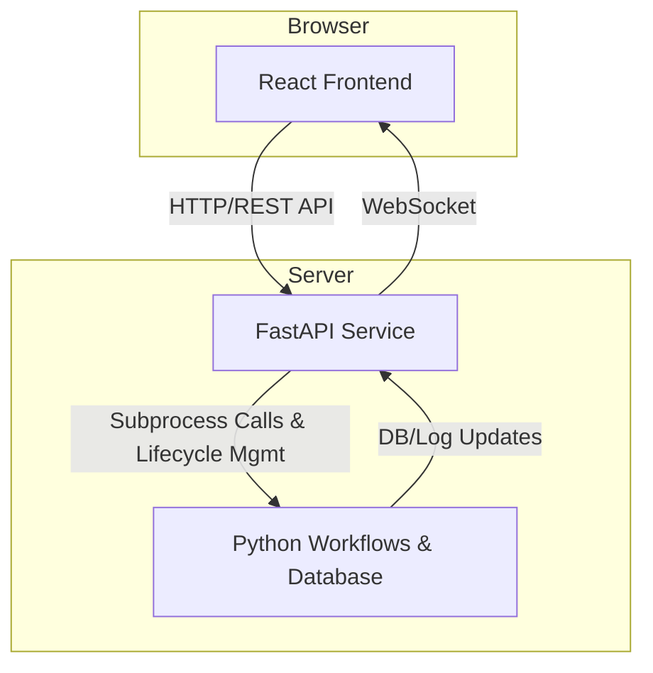

# HyperEventGraph 可视化界面架构设计文档

**版本**: 1.1
**作者**: Gemini Architect
**日期**: 2025-08-03

---

## 1. 核心目标与展示内容 (The "What")

本可视化界面的核心目标是将 HyperEventGraph 项目从一个纯后端的命令行工具集，转变为一个对数据分析师、领域专家和系统操作员都友好的、透明的Web应用程序。界面将围绕“**监控**”、“**探索**”与“**控制**”三大主题，提供以下核心内容展示：

### 1.1. 系统健康与进度监控
用户首先需要了解整个系统的宏观状态。
- **全局状态概览**: 以统计图表（如饼图）和关键指标卡片的形式，展示中央数据库 (`master_state.db`) 中所有数据的状态分布。��如：`25882 pending_triage`, `64754 pending_extraction`, `7372 completed` 等。
- **工作流实时状态**: 展示每个核心工作流（Triage, Extract, Cortex, Relations）的当前状态（`Idle`, `Running`, `Failed`）、上一次运行时间以及实时进度条。
- **实时日志流**: 提供一个动态的日志窗口，实时显示正在运行的工作流脚本的输出，为用户提供即时反馈。

### 1.2. 知识探索与分析
用户需要一个直观的方式来消费和理解最终生成的知识。
- **结构化事件浏览**: 提供一个可搜索、可分页、可排序的数据表格，用于展示 `structured_events.jsonl` 中的所有抽取结果。用户可以快速查找和审查单个事件的细节。
- **知识图谱可视化**: 这是系统的核心成果展示。我们将提供一个交互式的网络图，其中：
    - **节点 (Nodes)**: 代表“事件”和“实体”。节点的大小或颜色可以用来表示其重要性或类型。
    - **边 (Edges)**: 代表“关系”（如 `Causal`, `Temporal`）和实体与事件的“参与关系” (`INVOLVED_IN`)。
    - **交互性**: 用户可以通过点击节点来高亮其一度关系、查看其详细属性，并通过搜索框快速定位到图中的特定实体。

### 1.3. 数据与学习管理
用户需要与系统进行交互，输入数据��引导其学习。
- **数据输入**: 提供一个简单的文件上传界面，以启动整个处理流程。
- **交互式学习**: 将 `run_learning_workflow.py` 的命令行交互功能Web化。用户将能够查看事件簇、合并簇、并触发新Schema的生成和保存。

---

## 2. 技术选型与后端交互 (The "How")

为了实现上述展示内容，我们选择一套现代、高效且能与我们现有Python后端无缝集成技术栈。

### 2.1. 技术选型分析
- **现有框架/库**:
    - **前端**: 我们可以使用成熟的前端框架如 **React** 或 **Vue**。React 拥有更庞大的社区和生态，特别是在数据可视化领域，因此是首选。为了加速开发，我们将采用 **Material-UI (MUI)** 组件库，它提供了大量高质量的、开箱即用的UI组件。
    - **图可视化**: 存在多个优秀的前端图可视化库，如 `D3.js`, `vis.js`, `react-force-graph`。其中，**`react-force-graph`** 专门为React设计，性能优异，能够轻松处理数千个节点，非常适合我们的需求。
    - **后端API**: 为了将Python后端暴露给前端，我们需要一个API框架。**FastAPI** 是当前Python社区的最佳选择，它性能极高，基于Starlette和Pydantic构建，并能自动生成交互式的API文档（Swagger UI），这将极大地方便前后端���联调。

### 2.2. 前后端交互设计
前端（React）和后端（Python工作流）将通过一个新建的 **FastAPI 服务**进行解耦和通信。

- **前端到后端 (HTTP/REST API)**:
    - `GET /api/status`: 前端通过此接口获取数据库的全局状态统计，用于渲染Dashboard。
    - `POST /api/workflow/{workflow_name}/start`: 前端通过此接口发送“启动”命令，FastAPI接收到后，会使用Python的 `subprocess` 模块在后台启动相应的脚本。
    - `POST /api/workflow/{workflow_name}/stop`: （V2功能）前端通过此接口发送“停止”命令。
    - `GET /api/events`: 前端通过此接口获取分页、排序后的结构化事件数据，用于填充表格。
    - `GET /api/graph`: 前端通过此接口获取Neo4j中的图数据（节点和边），用于渲染知识图谱。

- **后端到前端 (WebSocket)**:
    - 为了实现实时进度和日志展示，FastAPI将建立一个WebSocket连接。
    - 后端工作流脚本在运行时��会将其标准输出（stdout）重定向。FastAPI服务会捕获这些输出，并通过WebSocket实时地将日志行推送给前端，前端接收到后动态更新UI。

---

## 3. V1 核心任务规划 (The "Plan")

基于以上设计，我们将此项目分解为以下可执行的V1任务。这些任务构成了可视化界面的基础。

- **任务1: 开发FastAPI后端服务**: 搭建API骨架，实现V1所需的所有REST端点和WebSocket逻辑。这是连接前后端的桥梁，是最高优先级。
- **任务2: 搭建React前端框架**: 初始化React项目，集成MUI和可视化库，构建基础的应用布局（导航栏、内容区）。
- **任务3: 实现Dashboard概览页面**: 开发前端Dashboard组件，并与 `/api/status` 端点对接。
- **任务4: 实现工作流控制中心**: 开发前端工作流管理组件，实现启动按钮和实时日志显示功能。
- **任务5: 实现知识浏览器**: 开发包含数据表格和交互式知识图谱的前端组件，并与 `/api/events` 和 `/api/graph` 端点对接。

这份文档为我们V1的开发工作提供了清晰的蓝图。V1的目标是快速交付一个具备核心监控和探索能力的版本。

---

## 4. V2 进阶控制功能规划

在V1版本交付并稳定运行后，我们将立即启动V2的开发，聚焦于提供更精细化的��程控制能力，真正实现系统的“可观测、可控制”。

### 4.1. 过程干预能力
- **目标**: 允许用户对正在运行的工作流进行生命周期管理。
- **功能**:
    - **停止 (Stop)**: 强制终止一个正在运行或卡死的工作流。
    - **暂停 (Pause)**: 临时挂起一个长时间运行的任务（如全量数据抽取），以便释放资源或检查中间结果。
    - **恢复 (Resume)**: 从暂停的位置继续执行任务。
- **实现思路**: 后端需要维护一个进程注册表，记录每个工作流子进程的PID。API端点将通过发送 `SIGSTOP`, `SIGCONT`, `SIGTERM` 等信号来实现对进程的控制。

### 4.2. 动态配置能力
- **目标**: 用户无需修改后端文件，即可通过UI调整工作流的关键参数。
- **功能**: 在启动工作流的弹窗中，提供表单让用户可以修改常用配置，如：
    - **模型选择**: 切换用于抽取或分析的LLM。
    - **批处理大小**: 调整每次处理的数据量。
    - **API密钥管理**: 安全地输入和更新外部服务密钥。
- **实现思路**: FastAPI在启动子进程时，将UI传入的参数通过命令行参数或临时环境变量的方式传递给工作流脚本。

### 4.3. 错误处理与恢复
- **目标**: 提升系统的容错性和鲁棒性，降低手动干预成���。
- **功能**:
    - **错误归档**: 工作流失败时，在UI上提供详细的错误报告链接。
    - **一键重试**: 为失败的任务提供一个“重试”按钮。
    - **断点续传**: 对于可分块的任务，实现从上一个成功处理的批次继续执行的功能。
- **实现思路**: 工作流脚本需要将错误信息结构化地写入数据库或日志文件。UI通过API读取这些信息。重试和断点续传需要在工作流脚本内部实现相应的逻辑。

### 4.4. 数据与版本管理
- **目标**: 对输入数据和输出结果进行版本化管理，支持回溯和对比分析。
- **功能**:
    - **输入数据批次管理**: 每次上传或处理的数据被视为一个独立的批次，拥有唯一ID。
    - **结果快照**: 每个批次成功运行后，其对应的事件、图谱等结果被保存为版本快照。
    - **版本切换**: 用户可以在UI上选择查看不同批次或版本的结果。
- **实现思路**: 这需要对数据库模式进行扩展，引入批次和版本的概念，所有数据表都与批次ID关联。
